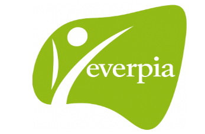

# projecta2
Benvinguts a EverPia, una consultora IT que té com a missió resoldre els reptes tecnològics de clients molt diversos. Acabeu d’incorporar-vos a l’empresa com a nous consultors júnior i, a partir d’avui, formareu part de l’equip que dona servei a diferents organitzacions. Cada client té les seves necessitats concretes i, sovint, semblen projectes inconnexos. Però no us enganyeu: el que realment us demanem és capacitat d’adaptació, visió global i organització.

L’origen d’EverPia es remunta a uns anys enrere, quan vuit professors —Rubén, Isabel, Carles Alonso, Cristian, Carles Fugarolas, Natalia i Núria— van decidir unir les seves forces. Tots ells compartien una passió: la informàtica i l’educació. Però també una convicció profunda: la tecnologia no té sentit si no ajuda a les persones i a les organitzacions a créixer.
El Rubén, el rei de la web.
La Isabel, experta en auditories.
El Carles Alonso, savi dels sistemes.
El Cristian, explorador de nous reptes.
El Carles Fugarolas, mestre de servidors i xarxes.
La Natalia, la estratega detallista i rigorosa.
La Núria, creadora d’idees i projectes.
Junts van fundar la consultora EverPia, un nom que uneix “ever” (sempre) amb “Pia”, en homenatge a l’esperit educatiu i a la visió de treballar per un futur millor. La seva llegenda comença en una petita sala plena de cables i ordinadors antics, on van jurar: “Mai treballarem sols. Cada projecte serà una oportunitat per créixer junts.”
Ara sou vosaltres qui entreu a formar part d’aquesta història. Acabeu de ser contractats com a consultors júnior d’EverPia i us enfrontareu a reptes reals, provinents de clients molt diferents. 
Cada encàrrec pot semblar independent, però tots formen part d’una mateixa aventura: demostrar que sou capaços de treballar amb professionalitat, rigor i esperit col·laboratiu.
El repte és clar: aprendre a funcionar com a consultora. Això implica no només resoldre problemes tècnics, sinó també organitzar-vos, planificar i documentar. A EverPia es treballa amb la metodologia Kanban, utilitzant l’eina Planner, i es valora moltíssim mantenir el 

---

## Tasques del projecta 2

[Tasca02](tasca02/readme.md)

[Tasca03](tasca03/readme.md)
